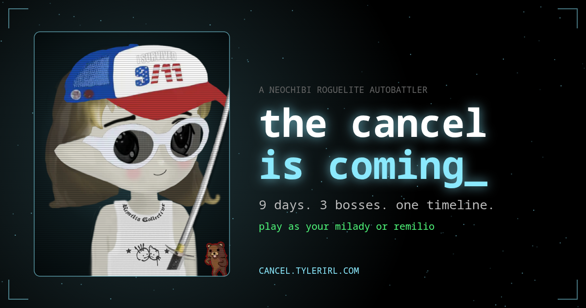

# the cancel is coming_

A neochibi roguelite autobattler. Nine days, three bosses, one timeline.

**Play it: [cancel.tylerirl.com](https://cancel.tylerirl.com)**



You are a Milady (or a Remilio) dropped into a maze with a hundred $CULT and a bad feeling. Loot what you can during the day. Find a campfire before night, because that's when the schizoposters come out. On day 3 something arrives to end you. Same on day 6. On day 9 it's THE CANCEL, and it does not negotiate.

Fights play themselves. Your job is everything before the fight: what you pick up, what you leave, and whether that elite is worth it at half health.

## How it plays

- **The maze.** 41×41, four districts, a boss gate in each. Loot hides in dead ends. Each district bends one rule in your favour.
- **Relics.** About 120 of them, in four rarities. Your character wears what she loots, so by day 6 you look like a problem.
- **Sets.** Every relic belongs to a set or two (ARMED, HYPEBEAST, DEGEN, KAWAII, CULT, SCHIZO, SQUAD, BONKLER, CHEESEWORLD, FLAMEWAR, BLOODSPORT, ICED OUT, THREE LETTER AGENCY, NIGHT SHIFT, TOUCH GRASS, FAST FOOD, WAR ROOM). Hold enough of one and it switches on.
- **Copies stack.** Two of the same relic count twice. Find Remilia Jackson and he'll fuse the pair into one GOLD item, freeing a slot. Two golds make a DIAMOND. He doesn't sell copies. You have to find them.
- **onno and Charlotte Fang.** They're in the maze too. onno takes one relic and hands back a random one of the same grade. Charlotte takes any two of the same grade and hands one of them back a grade higher. She decides which. One trade each, and neither lets you pick.
- **Scearpo.** Scorched earth policy. Hand him a relic and he flips a coin: it comes back a tier higher, or it burns.
- **Cursed altars.** A legendary relic, lying there, free. Take it and you carry a curse of your choosing for the rest of the run: a sealed slot, blood at every dawn, shops that won't serve you, or a chunk of your health.
- **The fountain.** Throw $CULT in. Give enough and it gives something rare back. It won't tell you how much is enough.
- **Defence hits back.** Armour bites anything that hits you. Every dodge is a free counter. A big health pool puts weight behind your swings. You don't have to stack attack.
- **No one stat wins.** Enemies are guarded: a single hit takes at most half their health, a quarter of a boss's, so nothing dies in one swing. Crit past 100% turns into crit damage. Burn, bleed, poison and companions grow stronger every day, the way enemies do.
- **The timeline pushes back.** Once the first boss is down, an elite or boss your build would walk through shows up stronger, and pays more for it. A better build still has better odds. It just never gets a free pass.
- **Burn, bleed, chill.** Three status effects, each with its own relics.
- **Rerolls.** Don't like a draft? Pay to roll it again. The price doubles every time, so the third one hurts.
- **Inflation.** Shops put their prices up 25% for every boss you beat.
- **Keys and vaults.** Keys are lying around. Vaults cost 100 $CULT to open and are worth it.
- **Bosses.** Drawn from a pool, so the run doesn't tell you who's coming until it does. At half health every boss stops the fight and makes you choose something.
- **The last three days.** From day 7 the interface itself starts to give: red at the edges, cracks in the timeline, things said in the feed. By day 9 you know something is arriving.
- **Nights.** Hunters path toward you. Campfires only work after dark: sleep at one to heal and skip to dawn, and it burns out. Every boss you beat makes the nights worse: the hunters come back tougher, faster, and eventually in greater number.
- **Done waiting?** Click the next boss on the timeline to fight it now. Win and it never shows up, so the days it would have taken are yours. It isn't free: a boss called out early hits harder for every day you skipped, and every call-out leaves the rest of the timeline tougher. Beat THE CANCEL itself before day 9 and every day you saved is worth points.
- **Tribes.** Hypebeast, Degen Trader, Lovebomber, Accelerationist, Wartime Poster. Each starts with its own relic.
- **Heat.** Win, and the game offers to get worse for more DRIP.

A few things that keep you from playing blind: every fight ends with a line on what did the damage, and you can pin a tile (right-click, long-press, or `P`) to come back to.

## Bring your own

Type in a Milady or Remilio token number and play as it. The game rebuilds the token from its trait layers, so a relic hat replaces the hat it came with, the way the maker would do it. Its Core picks your tribe and its drip score becomes starting $CULT. Ownership isn't checked. Nobody's checking.

You never fight your own collection. Everyone else is fair game: Pixeladys, Radbros, MiladyStation characters, Shiro's *oh.. I've seen*, and the SchizoPosters at night. Bonklers only show up as bosses.

## Daily map and sharing

One seed per day, turning over at midnight Eastern. Same maze for everyone, one leaderboard, one attempt: your first run of the day is the one that counts. Play it again if you like; that's practice. Any other run has a seed code too, and its link drops whoever opens it into the same map.

When a run ends you get a Wordle-style result to paste, and a link whose preview is that run's own card: your character as she finished, relics and all. The leaderboard shows everyone's final look side by side, and the hall of fame keeps each day's winner.

Play the daily on consecutive days and the title screen starts counting. Miss one and it stops.

## King of the hill

Beat THE CANCEL and you get one shot at the king: your final build against theirs, 1v1, every relic on both sides doing its thing. Win and the hill is yours until someone takes it, or until Sunday night (Eastern), when it empties and the first winner of the new week walks up unopposed. The title screen shows who's up there, what they're carrying, and how long they have left. Whoever is still standing when the week ends goes into the hall of fame in gold.

## Signing in

Optional. Sign in with RemiliaNET or an Urbit ID and your name on the boards is verified. Your unlocks, achievements, codex, record and streak also move to the account, so a second device picks up where the first left off. Unlocks are bought with DRIP and only work while you're signed in. They're switched off on the daily map, so everyone starts that one equal. Runs you posted before signing in move to your account the first time you do.

## Controls

Arrow keys do everything, including menus. Enter picks, Esc backs out, `B` opens your build. Mouse and touch work too: click a tile to walk there, swipe to step on a phone.

## Running it yourself

It's a static site. No build step, no framework, no dependencies. Even the animated backdrop is the game's own canvas: nothing is loaded from anywhere else.

```sh
git clone git@github.com:itsTylerIRL/cancel.git
cd cancel
python3 -m http.server
```

Then open `localhost:8000`. Opening `index.html` directly won't work; browsers block the asset loading.

| Where | What |
|---|---|
| `js/data.js` | all the content: relics, sets, enemies, bosses, events, tribes |
| `js/game.js` | the engine: maze, combat, avatar compositing, UI |
| `assets/img/` | every wearable Milady and Remilio trait layer |
| `server/` | the optional leaderboard service |
| `build.py` | packs the whole game into one `dist.html` for passing around |

Adding a relic is a line in `data.js` plus its numbers in `computeStats()` or `fightEngine()`. Its icon is just a pointer at a trait file: `["Remilio", "Hat", "Tinfoil"]`.

The leaderboard, share cards and sign-in are a small Python service that the game works fine without. Setup notes are in [`server/README.md`](server/README.md).

## Credits

Trait art is Remilia's, from [maker.remilia.org](https://maker.remilia.org). The SchizoPosters are by RIVERGOD. *oh.. I've seen* is by Shiro. The structure owes a lot to *He is Coming*. Fonts are JetBrains Mono and Anton, both under the Open Font License.

This is a fan project. It is not affiliated with Remilia Corporation, and nothing in it is for sale.

Made by [tyler](https://tylerirl.com).
